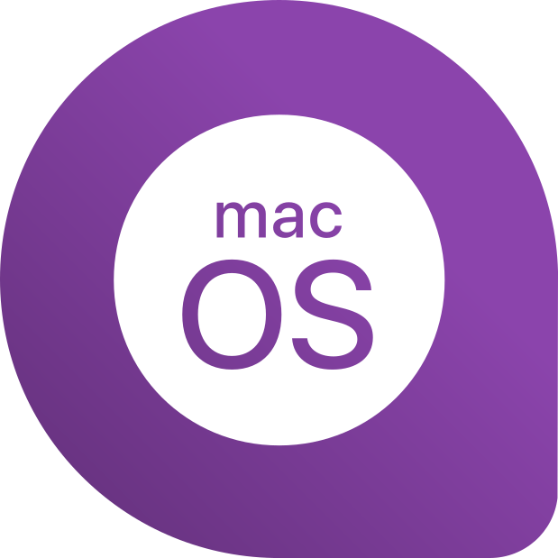
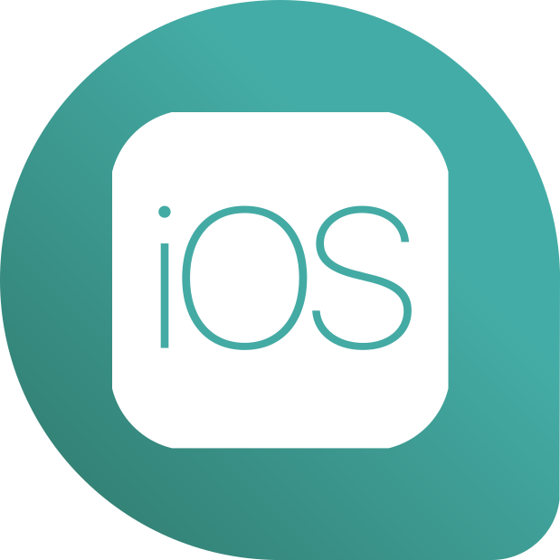

# Ldumay - App - .Net with Avalonia UI <a name="top"></a>

Création d'une applicaiton C# avec Avalonia UI.

- Site officiel : [avaloniaui.net](https://avaloniaui.net/)
- Documentation complète : [docs.avaloniaui.net](https://docs.avaloniaui.net/)
- Documentation complète de démarrage: [docs.avaloniaui.net](https://docs.avaloniaui.net/docs/getting-started)

> Supporté sur :
> 
> 
> 
> 
> 
> 
> 

## Sommaire

- 1 - [Pré-requis](#1)
- 2 - [Création d'une application Avalonia UI](#2)
  - 2.1 - [Importation d'un template Avalonia](#2-1)
  - 2.2 - [Création d'une application](#2-2)
- 3 - [Démarrer l'application](#3)
  - 3.1 - [Démarrer l'application via ligne de commande](#3-1)
  - 3.2 - [Démarrer l'application via Rider EAP7](#3-2)
    - 3.2.1 - [Installation de Rider EAP7 avec les extensions pour Avalonia](#3-2-1)
    - 3.2.2 - [Démarrage de l'application via Rider EAP7](#3-2-2)
  - 3.3 - [Démarrer l'application via Visual Studio](#3-3)
    - 3.3.1 - [Installation de Visual Studio avec les extensions pour Avalonia](#3-3-1)
    - 3.3.2 - [Démarrage de l'application via Visual Studio](#3-3-2)

## 1 - Pré-requis - [Haut de page](#top) <a name="1"></a>

- Dotnet : **6.0**

## 2 - Création d'une application Avalonia UI - [Haut de page](#top) <a name="2"></a>

### 2.1 - Importation d'un template Avalonia - [Haut de page](#top) <a name="2-1"></a>

```
dotnet new --install Avalonia.Templates
```

De plus, la commande affiche les templates installés.

```
Les packages de modèles suivants seront installés :

Opération réussie : Avalonia.Templates::0.10.18.2 a installé les modèles suivants :
Nom du modèle                        Nom court                  Langue   Balises
-----------------------------------  -------------------------  -------  -----------------------------------------
Avalonia .NET Core App               avalonia.app               [C#],F#  Desktop/Xaml/Avalonia/Windows/Linux/macOS
Avalonia .NET Core MVVM App          avalonia.mvvm              [C#],F#  Desktop/Xaml/Avalonia/Windows/Linux/macOS
Avalonia Cross Platform Application  avalonia.xplat             [C#],F#  Desktop/Xaml/Avalonia/Web/Mobile
Avalonia Resource Dictionary         avalonia.resource                   Desktop/Xaml/Avalonia/Windows/Linux/macOS
Avalonia Styles                      avalonia.styles                     Desktop/Xaml/Avalonia/Windows/Linux/macOS
Avalonia TemplatedControl            avalonia.templatedcontrol  [C#]     Desktop/Xaml/Avalonia/Windows/Linux/macOS
Avalonia UserControl                 avalonia.usercontrol       [C#],F#  Desktop/Xaml/Avalonia/Windows/Linux/macOS
Avalonia Window                      avalonia.window            [C#],F#  Desktop/Xaml/Avalonia/Windows/Linux/macOS
```

### 2.2 - Création d'une application - [Haut de page](#top) <a name="2-2"></a>

```
dotnet new avalonia.app -o MyApp
```

## 3 - Démarrer l'application - [Haut de page](#top) <a name="3"></a>

### 3.1 - Démarrer l'application via ligne de commande - [Haut de page](#top) <a name="3-1"></a>

Il est possible de démarrer l'application via ligne de commande de la manière suivante :

```
cd MyApp
dotnet run
```

### 3.2 - Démarrer l'application via Rider EAP7 - [Haut de page](#top) <a name="3-2"></a>

#### 3.2.1 - Installation de Rider EAP7 avec les extensions pour Avalonia - [Haut de page](#top) <a name="3-2-1"></a>

L'IDE JetBrains Rider a un support intégré pour Avalonia XAML [**à partir de la version 2020.3**](https://www.jetbrains.com/rider/whatsnew/2020-3/#version-2020-3-avalonia-support), y compris un support de première classe pour les fonctionnalités XAML spécifiques à Avalonia et les inspections de code personnalisées.

> **NB** : Consultez [**l'annonce de la version 2020.3**](https://www.jetbrains.com/rider/whatsnew/2020-3/#version-2020-3-avalonia-support) de JetBrains Rider pour plus d'informations. Rider ne fournit pas encore de concepteur visuel, mais cela est en cours de développement. Consultez [**le projet GitHub**](https://github.com/ForNeVeR/AvaloniaRider) pour plus d'informations et les instructions d'installation.

Cependant, il est nécessaire d'installer **l'édition EAP7 de Rider à partir de la version 2022.3 et ultérieur**.
- [Cliquer ici](https://plugins.jetbrains.com/plugin/14839-avaloniarider/) pour vérifier si votre version de Rider est compatible avec le plugin.

#### 3.2.2 - Démarrage de l'application via Rider EAP7 - [Haut de page](#top) <a name="3-2-2"></a>

Il suffit d'ouvrir **le projet** via Rider.


Ensuite, la détection doit se faire naturellement.


### 3.3 - Démarrer l'application via Visual Studio - [Haut de page](#top) <a name="3-3"></a>

#### 3.3.1 - Installation de Visual Studio avec les extensions pour Avalonia - [Haut de page](#top) <a name="3-3-1"></a>

Pour Visual Studio, Avalonia est déjà disponible en extension.

> **NB** : L'extension Avalonia pour Visual Studio comprend un concepteur XAML qui peut être utilisé pour afficher un aperçu en direct du XAML pendant que vous l'écrivez. Une fois l'extension Avalonia pour Visual Studio installée, double-cliquez sur un fichier XAML Avalonia pour l'ouvrir.
Si vous utilisez VS2019 ou VS2017, vous devez installer l'extension pour les anciennes versions.

Pour installer l'extension Avalonia dans Visual Studio :

1. Il suffit d'ouvrir **Visual Studio** ou via un projet.
2. Puis d'installer les extensions **Avalonia** (tel que sur l'image si dessus).


#### 3.3.2 - Démarrage de l'application via Visual Studio - [Haut de page](#top) <a name="3-3-2"></a>

Il suffit d'ouvrir **le projet** via Visual Studio.


Ensuite, la détection doit se faire naturellement.


## 4 - Guide d'apprentissage

- Tuto YouTube
  - [Avalonia UI](https://www.youtube.com/playlist?list=PLrW43fNmjaQWMhFHxS1jpQ34TkHroHJLb)